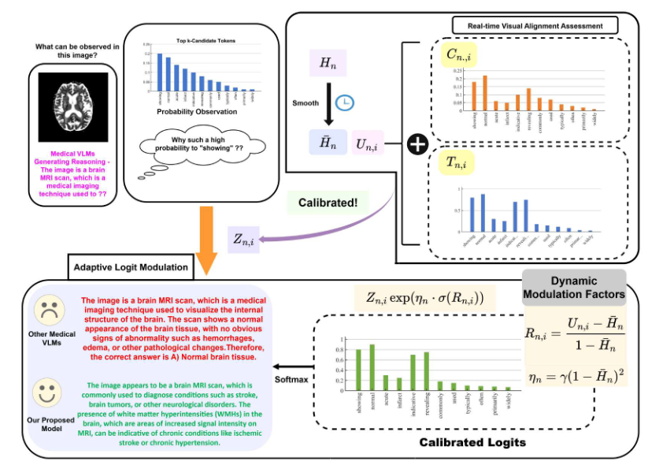

<p align="center">
  
</p>
<p align="center">
  <b>Fig. 2:</b> Overview of Proposed I2-Med Model.
</p>


## To Run 
1. Download the model weights of the [VLM](https://huggingface.co/yuxianglai117/Med-R1/tree/main) and [BioMedCLIP](https://huggingface.co/microsoft/BiomedCLIP-PubMedBERT_256-vit_base_patch16_224)
2. Set the parameters in run.sh
3. Use the following command
```bash
bash run.sh
```
## Interpretability
Here you can see the qualitative results from our Logits calliberation method . Our method improve the Reasoning in comparision to the base model
1. <br> 
2. <br> 
3. <br> 
4. <br> 


## Experimentation
### Implementation
All experiments are conducted in an inference-only setting on a single NVIDIA
A100 GPU (40GB). The proposed framework integrates medical visual ground-
ing directly into the autoregressive decoding process of the backbone medical
VLM, without modifying model parameters or requiring additional training.
For domain-specific visual–semantic alignment, we employ BioMedCLIP
(microsoft/BiomedCLIP-PubMedBERT_256-vit_base_patch16_224) as the im-
age–text similarity encoder. BioMedCLIP, pretrained on biomedical image–text
pairs, provides clinically relevant alignment signals that are more suitable for
medical reasoning than generic vision–language encoders.
During generation, candidate tokens are dynamically reweighted based on
their contextual visual consistency using the proposed sliding-window calibration
strategy. The following hyperparameters are used during inference:
* visual-top-k: 30
* window-size: 8
* batch-size: 16
* temperature: 0.0 (greedy decoding

**The visual-top-k parameter limits visual alignment evaluation to the top-30
candidate tokens at each decoding step, balancing computational efficiency and
grounding precision. A sliding window of size 8 preserves short-term contextual
coherence during reasoning. All remaining preprocessing, prompting templates,
and evaluation procedures follow standard medical VQA protocols.** 
the parameters are as mentioned in

```bash
bash run.sh
```

### Datasets
We evaluate the proposed framework on the open-access portion of the Omn-
iMedVQA benchmark , a large-scale medical vision question answering dataset
comprising 82,059 images and 88,996 question–answer pairs. OmniMedVQA
spans eight imaging modalities, including CT (15,808), MRI (31,877), X-Ray
(7,916), Ultrasound (10,991), Dermoscopy (6,679), Fundus (5,398), OCT (4,646),
and Microscopy (5,680), thereby covering a broad spectrum of anatomical, patho-
logical, and cellular imaging scenarios. In addition to modality diversity, the
dataset is organized into five clinically meaningful question categories: Anatomy
Identification (16,448), Disease Diagnosis (55,387), Lesion Grading (2,098), Modal-
ity Recognition (11,565), and Other Biological Attributes (3,498). This struc-
tured taxonomy enables systematic evaluation across both cross-modality and
cross-task reasoning settings. Following the official benchmark protocol, the
dataset is partitioned into training and testing splits using an 80–20 ratio. In
our experiments, we strictly operate in an inference-only regime and utilize only
the official testing split for evaluation. No additional fine-tuning or task-specific
adaptation is performed on OmniMedVQA, ensuring that performance gains
arise solely from the proposed inference-time visual grounding mechanism.

### Summary of Results 
In this subsection, we comprehensively evaluate the performance of the proposed
I2Med model across eight distinct medical imaging modalities.Comparison of performance across eight medical modalities against baseline
models in Table 1.Comparison of our proposed models with medical VLMs baselines on
five medical VQA tasks across five clinical reasoning types, evaluated under
general-purpose zero-shot, medical zero-shot, and fine-tuned models in Tabl 2. The quantitative
results are summarized in Table S.1. Additionally, we assess the effectiveness
of I2Med on five clinical reasoning tasks to examine its generalization capabil-
ity beyond imaging-based evaluation. The corresponding results are reported in
Table S.2

<p align="center">
  
</p>
<p align="center">
  
</p>
<p align="center">
  
</p>

<p align="center">
  
</p>


## Ablation Study
Window sensitivity of Logits calliberation

| window size| Accuracy  |
| --- | --- | 
| 8| 61.09%|
| 12 | 59.75% |
| 16 | 60.88% |
